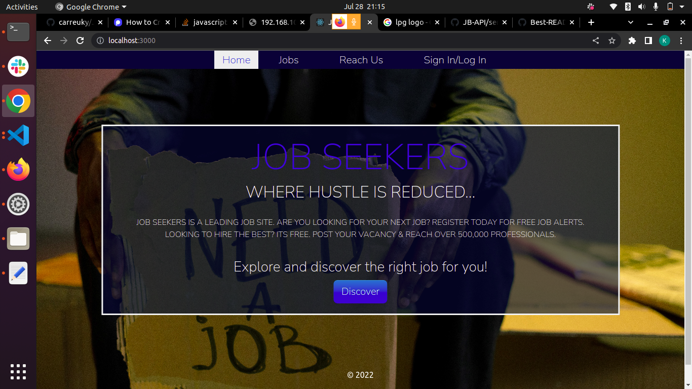
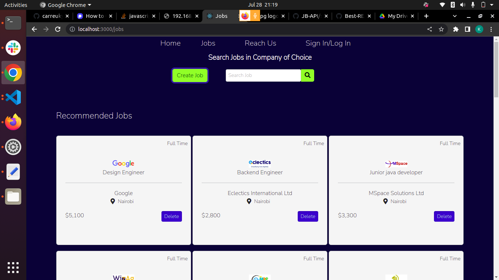

# Jobs Seekers

#### Created By Kelvin Nderitu on 28-07-2022


## Description

Jobs Seekers is a website that provides a way to create, delete and retrieve jobs. Reduces the hustle of job applicants accessing  websites of their desired companies to work for. A user is able to interact with the Application swiftly. Employers can use the web application to upload vacancies in their companies

## Setup Requirements

- Git
- Web-browser or your choice
- Github
- Node.js (https://nodejs.org/)
- NPM (https://www.npmjs.com/)

### Installation

_Below is the is how you can install and setup my app. This template doesn't rely on any external dependencies or services._

1. Clone the repo
   ```sh
   git clone https://github.com/your_username_/Project-Name.git
   ```
2. Install NPM packages
   ```sh
   npm install
   ```

<!-- USAGE EXAMPLES -->

## Technologies Used

The following have been used on this project:

- HTML
- CSS
- Bootstrap
- React JS
- JSON 

#### Demo Video <a href="https://drive.google.com/file/d/1LGem62hwxZxwGbvzhkbdNgb_6cAf8Oqa/view?usp=sharing">View Jobs Portal</a>
#### Live link to Web Application [View](https://jobprtal.herokuapp.com/)

## Screenshots of the Web Application

- Homepage

  

- Job Page

  

<!-- - Create Job Form Page

   -->

<!-- - Jobs

  

- Login Page

  

- Register Page

   -->
  
# GitHub Code

> > [Job-Portal Github Repo](https://github.com/carreuky/Job-Portal)

# Authors

> > [Kelvin Nderitu](https://github.com/carreuky)


## Known Bugs 🐛 

> > So far so good there are no bugs related to this project 😎

## Support and contact details 🙂

To make a contribution to the code used or any suggestions you can click on the contact link and email me your suggestions.

>> Email: carreuky@gmail.com

## License

Copyright (c) 2022 Kelvin Nderitu.

 The MIT License
 License: MIT
[](https://opensource.org/licenses/MIT)
